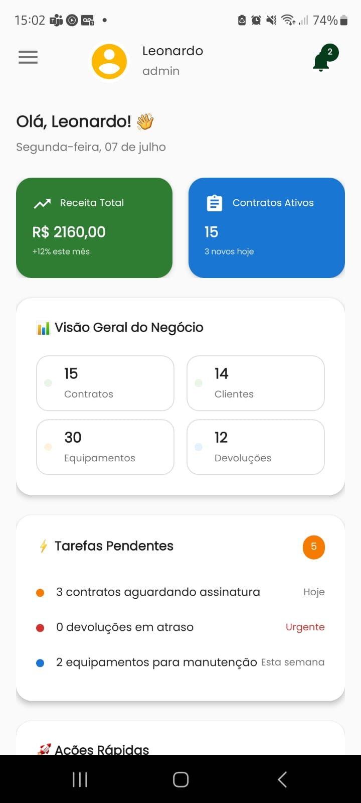
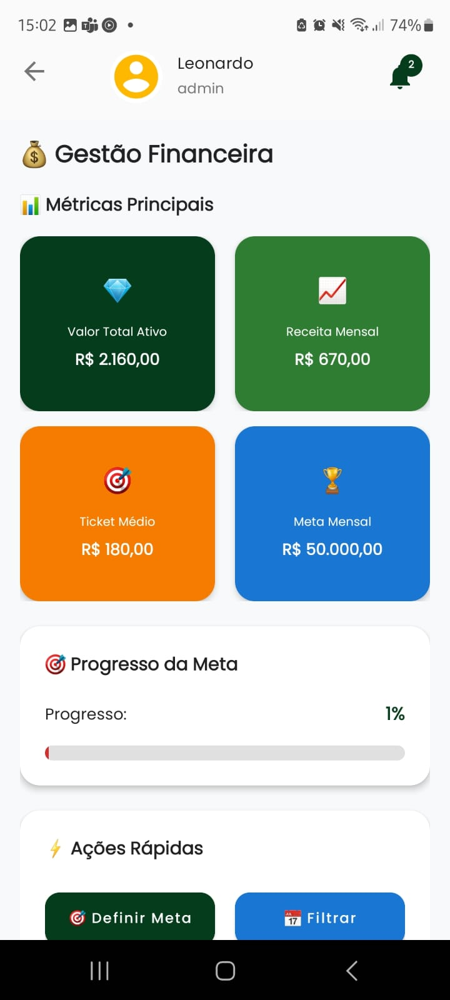
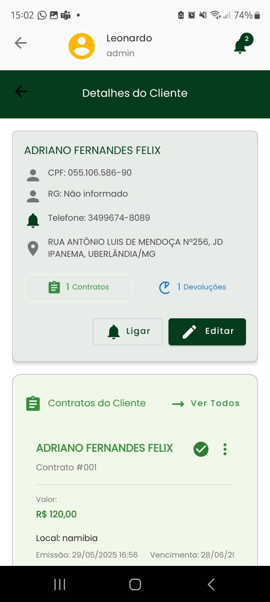
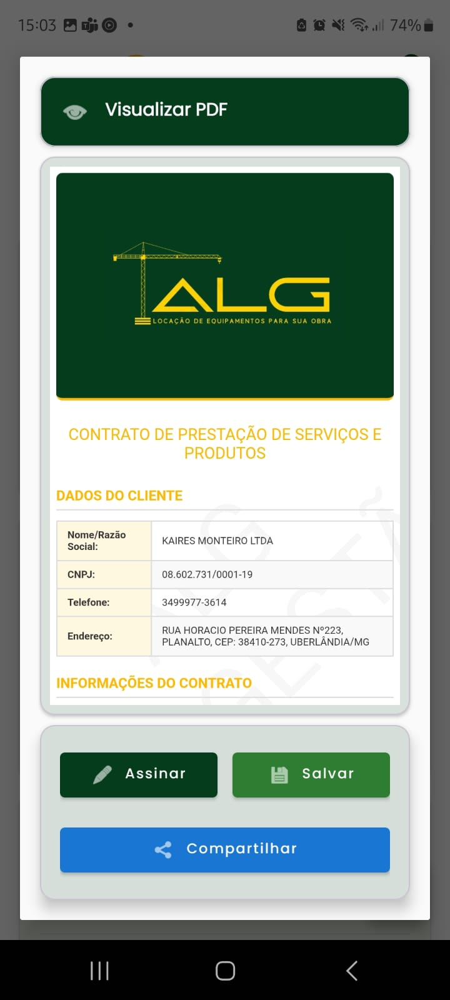

# 🏗️ ALG Gestão - Sistema de Locação de Equipamentos
<div align="center">  

</div>

---

[](https://developer.android.com/about/versions/nougat/)
[](https://kotlinlang.org/)
[](LICENSE)
[](#changelog)

**Sistema Android completo para gestão de contratos, clientes e equipamentos de locação com interface moderna e funcionalidades avançadas.**

---

## 🚀 Funcionalidades Principais

### 🔐 **Autenticação & Segurança**
- Login seguro com validação CPF/CNPJ e máscaras automáticas
- Gerenciamento de sessões (30 dias) com recuperação automática
- Diferentes níveis de acesso por usuário

### 👥 **Gestão de Clientes**
- Cadastro completo PF/PJ com validação de documentos
- Busca avançada e histórico detalhado
- Integração com contratos e devoluções

### 📋 **Sistema de Contratos**
- Criação via wizard intuitivo com seleção múltipla de equipamentos
- **Assinaturas digitais** via touch com validação
- **Geração automática de PDF** e controle de status em tempo real

### 🔧 **Controle de Equipamentos**
- Cadastro detalhado com especificações técnicas
- **Controle de disponibilidade em tempo real**
- Histórico completo e associação inteligente aos contratos

### 📦 **Sistema de Devoluções**
- Controle com múltiplos status e rastreamento completo
- Processamento detalhado com observações
- Alertas automáticos para devoluções em atraso

### 💰 **Módulo Financeiro Avançado**
- **Dashboard financeiro** com métricas em tempo real
- **Receita por cliente** com análise de períodos específicos
- **Filtros inteligentes** por mês/ano com dados precisos
- **Sistema de fallback** quando API indisponível
- Relatórios detalhados e geração de PDFs

### 📊 **Dashboard & Analytics**
- Visão geral em tempo real com métricas do negócio
- Cards informativos: receita, contratos ativos, equipamentos, devoluções
- Pull-to-refresh e navegação rápida entre módulos

---

## 🆕 Novidades da Versão 1.1.0

### 🎯 **Dialog de Seleção de Período**
Nova interface para escolha de período antes de abrir relatórios:
- **🗓️ Mês Atual**: Acesso rápido ao período atual
- **📊 Período Específico**: Seletores de mês/ano funcionais  
- **📈 Último com Dados**: Fallback inteligente

### 🔧 **Filtro Real por Período**
- **Validação de dados**: Verifica se pertencem ao período solicitado
- **Filtro local inteligente**: Funciona independente da API backend
- **Estado vazio**: Interface clara quando não há dados no período
- **Recálculo preciso**: Valores baseados apenas nos dados filtrados

### 🐛 **Correções Importantes**
- **Bug crítico de formatação**: Mês de referência agora exibe corretamente
- **Dropdowns funcionais**: AutoCompleteTextView agora funcionam como esperado
- **Crash corrigido**: Dialog de período abre sem problemas

---

## 📸 Screenshots

### **Interface Principal do Sistema**

<table>
  <tr>
    <td align="center" width="25%">
      <h4>📊 Dashboard</h4>
      
      <p><em>Visão completa com métricas em tempo real</em></p>
    </td>
    <td align="center" width="25%">
      <h4>💰 Gestão Financeira</h4>
      
      <p><em>Filtros por período e análises detalhadas</em></p>
    </td>
    <td align="center" width="25%">
      <h4>👤 Detalhes do Cliente</h4>
      
      <p><em>Histórico completo e contratos associados</em></p>
    </td>
    <td align="center" width="25%">
      <h4>📄 Visualizador PDF</h4>
      
      <p><em>Contratos e relatórios integrados</em></p>
    </td>
  </tr>
</table>

---

## 🛠️ Tecnologias

### **Stack Principal**
- **Linguagem**: Kotlin 100%
- **Arquitetura**: MVVM (Model-View-ViewModel) + Repository Pattern
- **Interface**: Material 3 Design + View Binding
- **Banco Local**: Room Database com TypeConverters
- **API**: Retrofit + OkHttp + Gson

### **Libraries Principais**
- **Concorrência**: Coroutines + Flow + LiveData
- **Navegação**: Navigation Component + Safe Args
- **Animações**: Lottie + Android Animations
- **Documentos**: PDF Generation + FileProvider
- **UI**: Material Design Components 3

---

## 📱 Requisitos & Instalação

### **Requisitos do Sistema**
- **Android**: 7.0+ (API level 24)
- **RAM**: Mínimo 2GB recomendado
- **Armazenamento**: 100MB livres
- **Internet**: Conexão para sincronização com API

### **Instalação**
```bash
# Clone o repositório
git clone https://github.com/teecoleonard/alg_gestao.git
cd alg_gestao

# Configure a API em data/api/ApiConfig.kt
# Build e execute
./gradlew assembleDebug
```

---

## 📁 Estrutura do Projeto

```
app/src/main/java/com.example.alg_gestao_02/
├── 🔐 auth/                    # Sistema de autenticação
├── 📊 dashboard/               # Dashboard principal
├── 🎨 ui/                      # Interface do usuário
│   ├── 👥 cliente/             # Módulo de clientes
│   ├── 📋 contrato/            # Módulo de contratos
│   ├── 🔧 equipamento/         # Módulo de equipamentos
│   ├── 📦 devolucao/           # Módulo de devoluções
│   ├── 💰 financial/           # Módulo financeiro
│   └── 🔧 common/              # Componentes comuns
├── 🗄️ data/                   # Camada de dados
│   ├── 🌐 api/                 # Serviços de API
│   ├── 🗃️ db/                 # Banco Room
│   ├── 📋 models/              # Modelos de dados
│   └── 🔄 repository/          # Repositórios
├── 🛠️ service/                # Serviços especializados
├── 🔔 manager/                 # Gerenciadores
├── 🎛️ utils/                  # Utilitários
└── 🧩 adapter/                # RecyclerView Adapters
```

---

## 🧪 Testing

```bash
# Testes unitários
./gradlew test

# Testes instrumentados
./gradlew connectedAndroidTest

# Build completo
./gradlew build
```

---

## 📋 Changelog

Veja [CHANGELOG.md](CHANGELOG.md) para histórico completo de mudanças.

### Versões Recentes
- **[1.1.0]** - Dialog de período funcional, dropdowns corrigidos
- **[1.0.3]** - Nova arquitetura UX, filtro real por período  
- **[1.0.2]** - Sistema de fallback inteligente
- **[1.0.1]** - Módulo financeiro com filtros
- **[1.0.0]** - Lançamento inicial

---

## 📄 Licença

Este projeto está licenciado sob a **MIT License** - veja [LICENSE](LICENSE) para detalhes.

---

## 👨‍💻 Autor

**Leonardo Henrique**  
📧 [leonardo4q@gmail.com](mailto:leonardo4q@gmail.com)  
🐙 [@teecoleonard](https://github.com/teecoleonard)  
💼 [LinkedIn](https://www.linkedin.com/in/leonardohenriquedejesussilva/)

---
